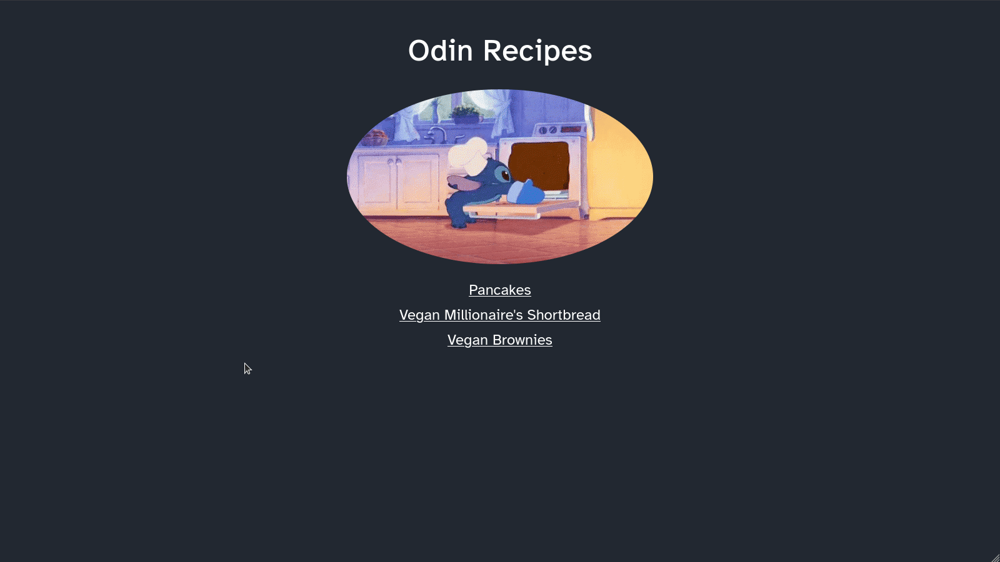
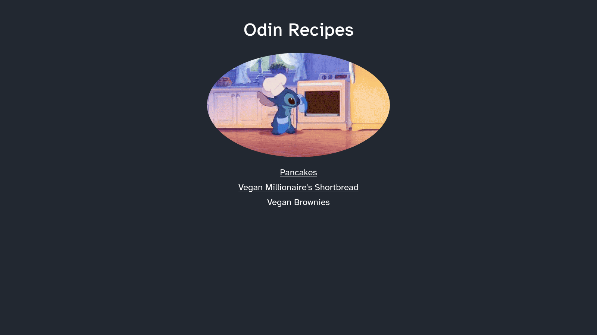
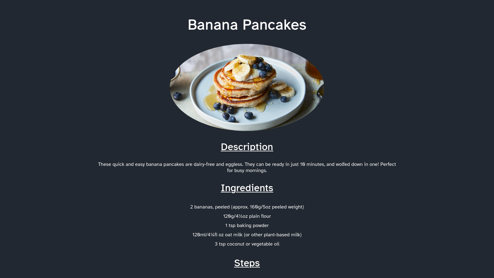

	<h1>Recipe Webpage
	 
		
		
		 
	</h1>
	<h3><b><a href="https://clarasmyth.github.io/odin-recipes/">View Live Demo</a></b></h3>

## Description

This is my first webpage created as part of [TheOdinProject](https://www.theodinproject.com) curriculum.

To see the assignment details - [Click Here](https://www.theodinproject.com/lessons/foundations-recipes)

## Built Using

-   HTML5 
-   CSS3 

## Credits

#### Icons

[Simple Icons](https://simpleicons.org/)

## Gallery

#### Home page

#### Menu page

